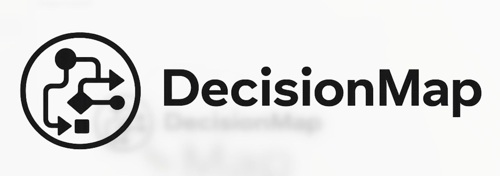

# DecisionMap



[](LICENSE)
[](https://github.com/markoblogo/decision-map/stargazers)
[](https://github.com/markoblogo/decision-map/commits/main)

**A practical protocol for using AI to map complex business and product decisions.**

DecisionMap is a protocol + prompt toolkit, not a SaaS product and not a new AI model.

It is a structured way to think through decisions where there is no single correct answer, only trade-offs under uncertainty.

---

## What it is

DecisionMap helps you turn messy, high-stakes business, product, market, and marketing situations into a **map of strategic options**.

It is especially useful when the problem is not lack of intelligence, but a fragmented or distorted picture of reality.

Instead of asking:
> “What should we do?”

it reframes the problem as:
> “What are our real options, and what does each of them cost?”

Each option is mapped by:
- expected upside
- cost (money, time, reputation, risk)
- required resources
- likely reactions from competitors, customers, or partners
- short / mid / long-term effects
- assumptions
- breakpoints (where it fails)
- signals to monitor

The core output is not a final answer.

It is a **working strategic hypothesis**, with visible trade-offs.

---

## What it is not

DecisionMap is not:
- a chatbot that gives advice
- a prediction engine
- a replacement for decision-makers
- a “smart agent” that thinks for you

It does not:
- guarantee outcomes
- remove uncertainty
- make decisions on your behalf

And it is intentionally out of scope for:
- military or political conflict
- legal or medical advice
- financial investment decisions
- M&A, layoffs, or HR restructuring

---

## When to use it

Use DecisionMap when:
- you have multiple plausible strategies and no clear winner
- the decision involves trade-offs, not right vs wrong
- competitors or external reactions matter
- you feel stuck because the picture is unclear

---

## How it differs from a normal AI chat

Many AI chats jump from context to a clean recommendation too quickly.

DecisionMap forces a disciplined process:
1. clarify the problem
2. separate facts, assumptions, interpretations, and unknowns
3. ask only questions that can change the strategy map
4. build multiple realistic strategies
5. compare trade-offs, resources, risks, and breakpoints
6. pressure-test shortlisted options
7. produce a decision record and working hypothesis

This is slower, but better aligned with real strategic decisions.

---

## Usage

For a full copy-paste workflow with any LLM, see [USAGE.md](USAGE.md).

## Quick start (manual)

You don’t need any app.

1. Set the system prompt from `prompts/system_prompt.md`
2. Run `01_intake.md` with your situation
3. Answer `02_clarifying_questions.md`
4. Generate options via `03_strategy_map.md`
5. Deep dive with `04_deep_dive.md`
6. Finalize with `05_decision_summary.md`

Optional: track updates using `schemas/cascade_log.schema.json`.

For the full step-by-step version, use [USAGE.md](USAGE.md).

---

## Examples

- [examples/full_run_product_launch.md](examples/full_run_product_launch.md) — complete end-to-end example
- [examples/product_launch.md](examples/product_launch.md) — compact product launch case
- [examples/competitive_response.md](examples/competitive_response.md) — compact competitive response case

---

## ABVX ecosystem

DecisionMap can be used as a standalone protocol with any LLM.

Inside the ABVX ecosystem:
- `lab.abvx` lists it as a decision/strategy protocol artifact
- `agentsgen` can maintain repo-local agent docs for contributors
- `SET` can track/audit the repository as part of orchestration flows
- `ID` can optionally provide portable user context for long-running decision work

None of these integrations are required for manual use.

## Optional ABVX integration

- `DecisionMap` stays standalone and usable with any LLM.
- `ID` is an optional context layer, not a dependency.
- `SET` should track and audit this repo, but not run runtime orchestration yet.
- `agentsgen` is the preferred path for repo-local agent-facing docs (`AGENTS.md`, `RUNBOOK.md`, `.agentsgen.json`).
- `lab.abvx` should position DecisionMap as a supporting tool in **Decision & Strategy Protocols**, not as core stack infrastructure.

---

## What is included in v0.1

- protocol
- reusable prompts
- JSON schemas
- manual usage workflow
- example cases
- Codex notes for a future mini-tool

## What is not included yet

- web app
- hosted service
- authentication
- persistent project memory
- LLM integration
- local model runner

---

## Repository structure

```text
decision-map/
├── README.md
├── USAGE.md
├── protocol.md
├── prompts/
│   ├── system_prompt.md
│   ├── 01_intake.md
│   ├── 02_clarifying_questions.md
│   ├── 03_strategy_map.md
│   ├── 04_deep_dive.md
│   └── 05_decision_summary.md
├── schemas/
│   ├── strategy_map.schema.json
│   └── cascade_log.schema.json
├── examples/
│   ├── full_run_product_launch.md
│   ├── product_launch.md
│   └── competitive_response.md
├── codex/
│   ├── build_prompt.md
│   └── implementation_notes.md
├── LICENSE
└── .gitignore
```

---

## Privacy

DecisionMap does not require storing data.

However:
- most hosted LLM APIs process data externally
- your input may be processed by third-party providers

For sensitive work:
- anonymize names, companies, exact financials, customer data, and internal documents
- or run in a local model / approved internal environment

---

## Future direction (optional)

Future versions may include:
- project mode
- cascade logs for long-running decisions
- structured memory of decisions, assumptions, signals, outcomes, and revisions

But the core value is already here:
- options, not answers
- working hypothesis, not final truth
- clarity under uncertainty

---

## Version

Current status: v0.1 protocol draft.
